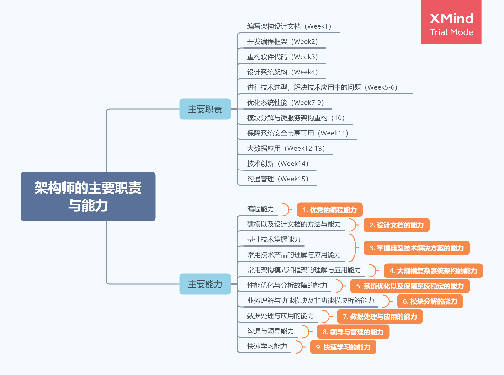
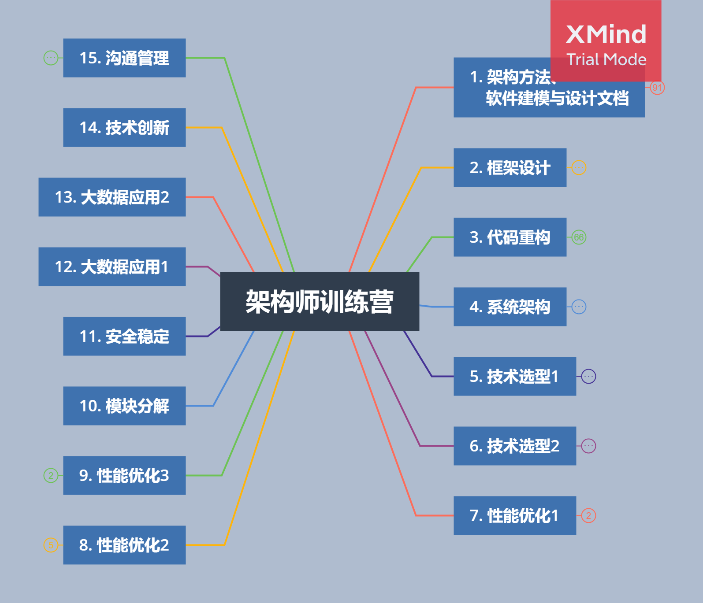

# 极客大学架构师训练营文章索引

本仓库记录我了三个月的时间(2020.6.4 - 2020.9.19)，参加 *李智慧* 老师极客大学<<架构师训练营>>中产出的：每周课堂总结、每周作业以及最后的两个大作业。

## 架构师的主要职责与能力

1. 主要职责

    1. 编写架构设计文档
    2. 开发编程框架
    3. 重构软件代码
    4. 设计系统架构
    5. 进行技术选型，解决技术应用中的问题
    6. 优化系统性能
    7. 模块分解与微服务重构
    8. 保障系统安全与高可用
    9. 大数据应用
    10. 技术创新
    11. 沟通管理

2. 主要能力

    1. 优秀的编程能力
    2. 设计文档的能力
    3. 掌握典型技术解决方案的能力
    4. 大规模复杂系统架构的能力
    5. 系统优化及保障系统稳定的能力
    6. 模块分解的能力
    7. 数据处理与应用的能力
    8. 领导与管理的能力
    9. 快速学习的能力

## 架构师训练营课程安排

## 每周课堂总结及作业

1. 第一周：[架构方法、软件建模与设计文档](https://xie.infoq.cn/article/70429a1f8f0b5bb11e12451d9)
    - 作业：[食堂就餐卡系统设计](https://xie.infoq.cn/article/2ca146c591ab0572c5bb3c474)

2. 第二周：[框架设计](https://xie.infoq.cn/article/bf7de21f6c51cbf743ade77e9)
    - 作业：[依赖倒置、框架、Cache 类设计](https://xie.infoq.cn/article/aa30761528d97d4fb47074c14)

3. 第三周：[代码重构与设计模式](https://xie.infoq.cn/article/9d9bd7782c16bed4dcde3a28e)
    - 作业：[单例模式与组合模式](https://xie.infoq.cn/article/25f8f0ef4fc0e9a60f2235448)

4. 第四周：[系统架构 - 互联网分布式系统架构及演化](https://xie.infoq.cn/article/a20e190b9a97ae0b813233cb9)
    - 作业：[一个典型的大型互联网应用系统使用了哪些技术方案和手段，主要解决什么问题？](https://xie.infoq.cn/article/e0c95b21930507952325ad08a)

5. 第五周：[技术选型1 - 分布式缓存、消息队列、负载均衡、数据库](https://xie.infoq.cn/article/a429ed3bad437c36b7d98eac0)
    - 作业：[一致性哈希算法 Java 实现](https://xie.infoq.cn/article/2b08edc4ab9ed4875178c9341)

6. 第六周：[技术选型2 - NoSQL、分布式锁架构、搜索引擎架构、Doris](https://xie.infoq.cn/article/373a324dc2c8606fc43090090)
    - 作业：[简述 CAP 原理](https://xie.infoq.cn/article/6c0046276fe68031103f3c893)

7. 第七周：[性能优化1 - 系统性能测试与分析](https://xie.infoq.cn/article/0c1d6ebe17de32a140c4c26f8)
    - 作业：[性能压测的时候，随着并发压力的增加，系统响应时间和吞吐量如何变化，为什么？ Web 性能压测工具](https://xie.infoq.cn/article/646fbd77d2ab24bedada5b423)

8. 第八周：[性能优化2 - 操作系统、内存、数据库优化](https://xie.infoq.cn/article/09a8732eab55fb5d9ec074f7c)
    - 作业：[单向链表合并、DataNode 服务节点宕机时，HDFS 处理过程时序图](https://xie.infoq.cn/article/2c53eefda56dc5c51c8f712c0)

9. 第九周：[性能优化3 - JVM](https://xie.infoq.cn/article/ee8842f193e0984c67daaaa9a)
    - 作业：[JVM 垃圾回收原理、设计一个秒杀系统，主要的挑战和问题有哪些？](https://xie.infoq.cn/article/7262e012fec6ae144c7706cbf)

10. 第十周：[模块分解 - 微服务与领域驱动设计](https://xie.infoq.cn/article/ba366bae4f1c4866781ae05ad)
    - 作业：[根据微服务框架 Dubbo 调用的时序图。关于微服务（中台架构、领域驱动设计、组件设计原则）思考和认知](https://xie.infoq.cn/article/fbc89afae0c27b30e7a02c24e)

11. 第十一周：[安全稳定 - 安全与高可用](https://xie.infoq.cn/article/7cfb810fc4fbd871acd71c58c)
    - 作业：[导致系统不可用的原因有哪些？保障系统高可用的方案有哪些？请用你熟悉的编程语言编写一个用户密码验证函数 boolean checkPW(String 用户ID, String 密码明文，String 密码密文](https://xie.infoq.cn/article/e8562c21b212e9bd6b7bd02f4)

12. 第十二周：[大数据应用1 - 大数据、Hadoop、HDFS、MapReduce、Shuffle](https://xie.infoq.cn/article/b2ff44c8f2e46047407ca3cf8)
    - 作业：[你所在的公司（行业、领域），正在用大数据处理哪些业务？可以用大数据实现哪些价值？分析 HiveSQL 生成的 MapReduce 程序，map 的函数的输入/输出是什么？reduce 函数的输入/输出是什么？](https://xie.infoq.cn/article/342eeb139098d45fbeb967f55)

13. 第十三周：[大数据应用2 - Spark & 流计算、数据分析与机器学习](https://xie.infoq.cn/article/38c8314c63cae7d110909629b)
    - 作业：[Google 搜索引擎是如何对搜索结果进行排序的？（请用自己的语言描述 Google PageRank 算法）](https://xie.infoq.cn/article/02f2d74f4f23e7cdf270a0edd)

14. 第十四周：[大数据平台 & 区块链](https://xie.infoq.cn/article/5bba1fdc432342dc177e2def3)

15. 第十五周：[技术管理](https://xie.infoq.cn/article/a02f979722f83df8c67321561)

## 大作业

1. [通达物流系统架构设计文档](https://xie.infoq.cn/article/3f3f5db1960ec52bc07ed65dd)
2. [架构师训练营知识点思维导图](https://xie.infoq.cn/article/a9a2c1829b6393facdaa91a43)
